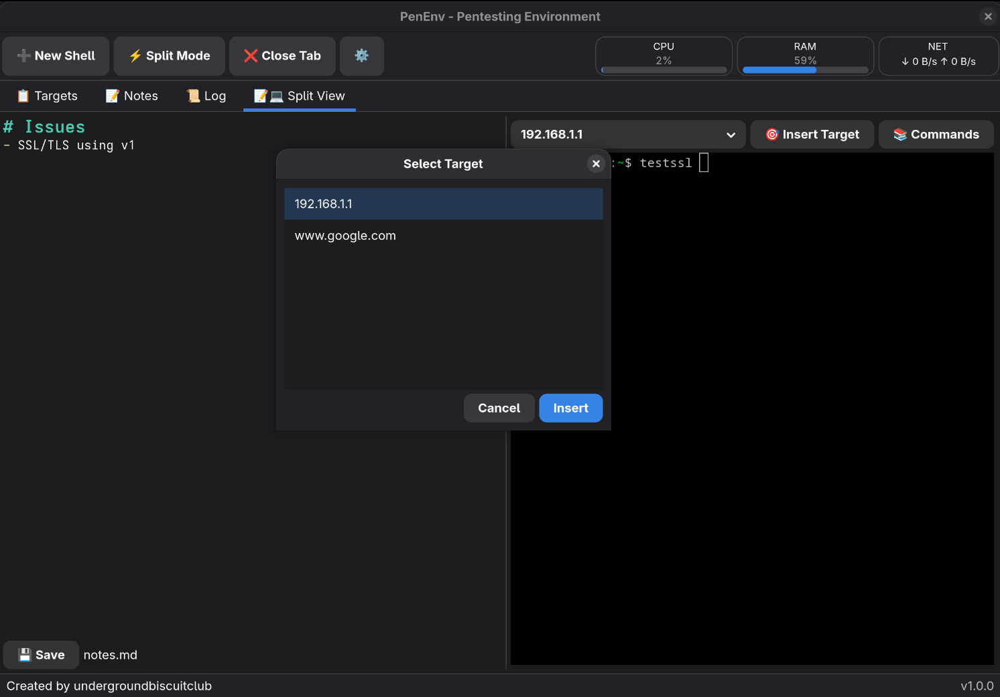
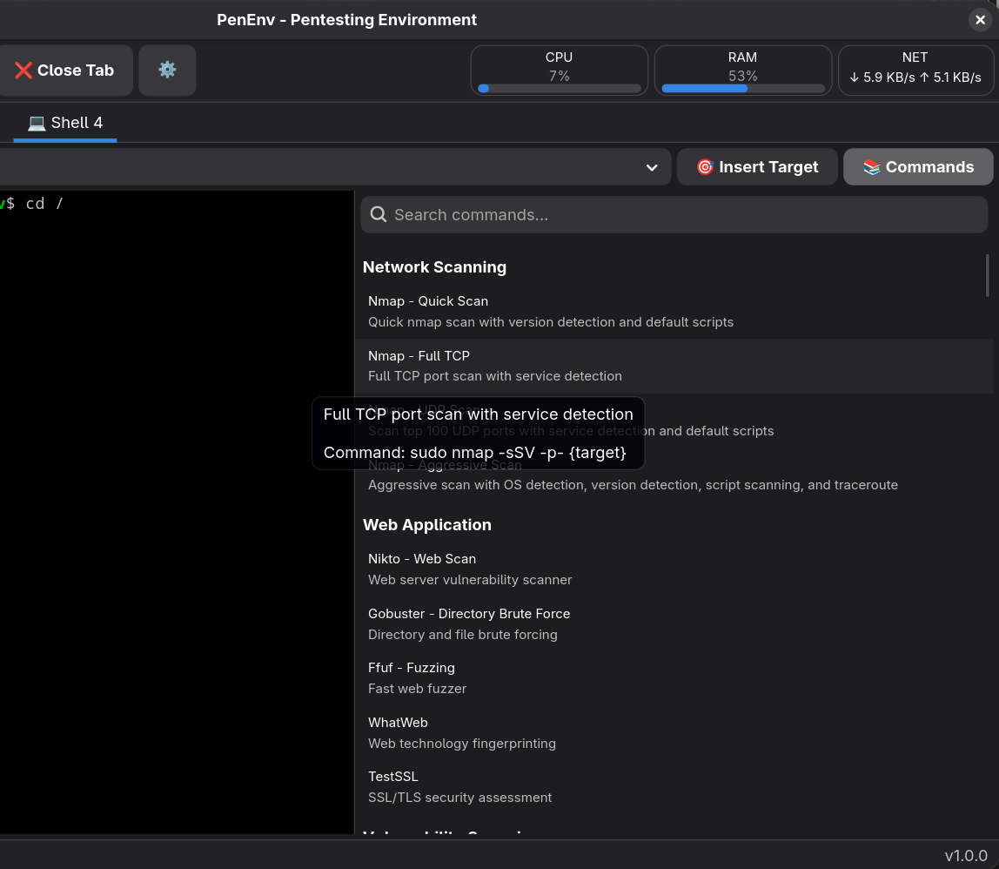
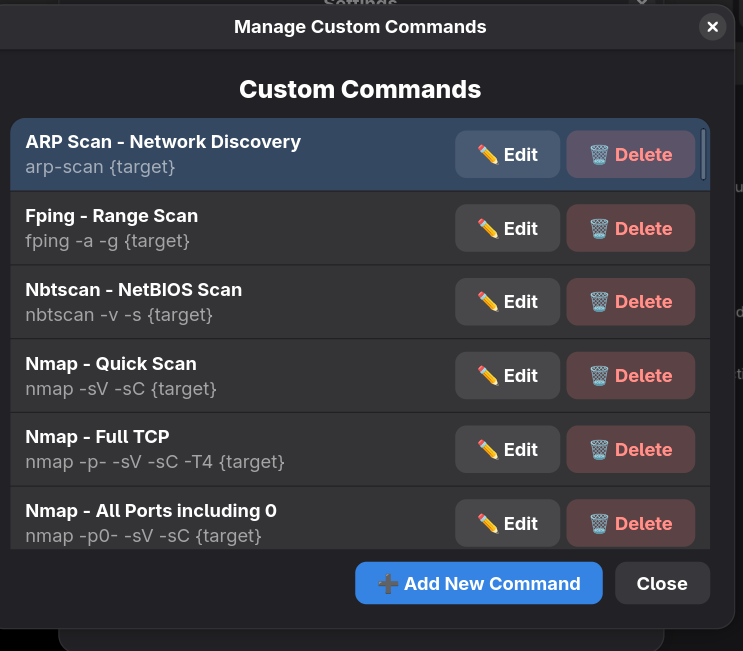

# PenEnv

A modern GTK4 desktop application for managing penetration testing environments with integrated shells, note-taking, and target management.



Use of generic commands:


Add custom commands:


## Features

- **Tabbed Interface**: Multiple tabs for easy navigation
- **Fixed Tabs**:
  - **Targets Tab**: Editable list of test targets (saved to `targets.txt`)
  - **Notes Tab**: Markdown notes editor with syntax highlighting (saved to `notes.md`, auto-saves)
  - **Command Log Tab**: View logged commands with timestamps (auto-updates)
- **Shell Tabs**: Create and manage multiple bash shell tabs with full terminal functionality
  - **Command Templates Drawer**: Built-in library of 30+ common penetration testing commands
    - Searchable command database (nmap, nuclei, gobuster, etc.)
    - Commands organized by category (Network Scanning, Web Application, Exploitation, etc.)
    - One-click command insertion with {target} and {port} placeholders
    - Hover tooltips showing command descriptions
    - Toggle drawer with "📚 Commands" button
  - **Custom Commands**: Add, edit, and manage your own command templates
    - Stored in `~/.config/penenv/custom_commands.yaml`
    - Support for {target} placeholders
    - Categorize and organize your commands
- **Split View Mode**: Click "⚡ Split Mode" to create a tab with notes on the left and shell on the right
  - Perfect for documenting findings while actively testing
  - Notes auto-save and sync with main Notes tab
  - Full shell functionality with command drawer available
  - Adjustable split position
- **System Monitoring**: Real-time CPU, RAM, and network traffic monitors
  - Configurable visibility via settings
  - Live updates every second
  - Compact display in toolbar
- **Target Management**: 
  - Dropdown selector to quickly insert targets into shell commands
  - Quick popup selector with customizable shortcut (default `Ctrl+T`) for keyboard-driven target selection
  - Automatic target list updates when `targets.txt` is saved
  - Target insertion available in shell tabs, notes tab, and split view
  - Comment support - lines starting with `#` are ignored in target lists
- **Command Logging**: All commands executed in shells are automatically logged with timestamps to `commands.log`
- **Markdown Syntax Highlighting**: VS Code-style theming for notes with headers, bold, italic, code blocks, links, and more
- **Tab Renaming**: Double-click shell tab names to rename them
- **Base Directory Selection**: Choose where to store project files on startup
- **Settings Dialog**: 
  - Configure system monitor visibility (CPU, RAM, Network)
  - Customize keyboard shortcuts for drawer toggle and target insertion
  - Manage custom commands
  - Settings persisted to `~/.config/penenv/settings.yaml`

## Installation

#### System Dependencies

- GTK4
- libadwaita
- VTE4 (Virtual Terminal Emulator)

#### Rust Dependencies (automatically handled by Cargo)

- gtk4 = "0.9"
- libadwaita = "0.7"
- chrono = "0.4"
- ropey = "1.6"
- vte4 = "0.8"
- serde = "1.0" (with derive feature)
- serde_yaml = "0.9"
- sysinfo = "0.32"

#### Development Tools

- Rust (1.70 or later)
- Cargo

#### Install System Dependencies

##### Fedora/RHEL

```bash
sudo dnf install gtk4-devel libadwaita-devel vte291-gtk4-devel
```

##### Ubuntu/Debian

```bash
sudo apt install libgtk-4-dev libadwaita-1-dev libvte-2.91-gtk4-dev
```

##### Arch Linux

```bash
sudo pacman -S gtk4 libadwaita vte4
```

### Building from Source

```bash
# Clone or navigate to the project directory
cd penenv

# Build the project
cargo build --release

# The binary will be available at target/release/penenv
```

### Installing

#### Option 1: Using Installation Script (Recommended)

```bash
./install.sh
```

This will:
- Build the release binary
- Install it to `~/.local/bin/penenv`
- Install the application icon
- Register the application with your desktop environment

#### Option 2: Build Distribution Packages

Build DEB or RPM packages for easier distribution and installation:

```bash
./build-packages.sh
```

Then select:
- **1** for DEB package (Ubuntu/Debian)
- **2** for RPM package (Fedora/RHEL/CentOS)
- **3** for both

Install the package:

```bash
# For DEB (Ubuntu/Debian)
sudo dpkg -i target/debian/penenv_0.1.0-1_amd64.deb
sudo apt-get install -f  # Fix dependencies if needed

# For RPM (Fedora/RHEL)
sudo dnf install target/rpm/penenv-*.rpm
```

#### Option 3: Manual Installation

```bash
# Install to cargo bin directory
cargo install --path .

# Or copy the binary to a location in your PATH
cp target/release/penenv ~/.local/bin/
```

## Usage

Start PenEnv:

```bash
penenv
```

Or launch from your application menu.

### First Run

On first launch, PenEnv will ask you to select a base directory for storing project files:
- Choose the current directory, or
- Browse to select a different location

This directory will contain your `targets.txt`, `notes.md`, and `commands.log` files.

### System Monitoring

PenEnv includes real-time system monitors in the top-right toolbar:
- **CPU** - Current CPU usage percentage
- **RAM** - Current memory usage percentage  
- **NET** - Network traffic (download/upload rates)

Configure monitor visibility via **⚙️ Settings** → **Monitor Settings**

### Custom Commands

In addition to the 30+ built-in penetration testing commands, you can add your own:

1. Click **⚙️ Settings** button
2. Click **📝 Manage Custom Commands**
3. Click **➕ Add New Command**
4. Fill in the form:
   - **Command Name**: Display name (e.g., "Quick Scan")
   - **Command**: The actual command (e.g., `nmap -sV {target}`)
   - **Description**: Brief description
   - **Category**: Organizational category (e.g., "Custom")
5. Click **Save**

Custom commands are stored in `~/.config/penenv/custom_commands.yaml` and appear alongside built-in commands in the command drawer.

#### Managing Custom Commands

From the **Manage Custom Commands** dialog:
- **✏️ Edit** - Modify existing custom commands
- **🗑️ Delete** - Remove custom commands
- **➕ Add New Command** - Create new custom commands

Use `{target}` as a placeholder in commands - PenEnv will automatically prompt for target selection when executing commands with this placeholder.

### Keyboard Shortcuts

#### Global Shortcuts (work anywhere in the application)

- `Ctrl+1` through `Ctrl+9` - Switch to tab 1-9
- `Ctrl+T` - Open target selector popup (default, customizable in settings)
- `Ctrl+S` - Save file (in Targets/Notes tabs)
- `Ctrl+\`` - Toggle command drawer and focus search (default, customizable in settings)

**Note**: The target insertion (`Ctrl+T`) and drawer toggle (`Ctrl+\``) shortcuts can be customized in **⚙️ Settings** → **Keyboard Shortcuts**. Choose any key to combine with Ctrl for your preferred workflow.

#### Tab Management

- Click **➕ New Shell** button - Create new shell tab
- Click **⚡ Split Mode** button - Create split view tab with notes + shell
- Click **❌ Close Tab** button - Close current tab (shell tabs only)
- Click **⚙️ Settings** button - Open settings dialog
- Double-click tab name - Rename shell tab

#### Target Selector Popup

- `↑/↓` or `Mouse` - Navigate targets
- `Enter` or `Double-click` - Insert selected target into shell
- `Esc` - Close popup

#### Shell Tab Features

- Full bash functionality with tab completion
- Command history (arrow keys)
- All standard terminal shortcuts
- Target insertion via button, dropdown, or customizable popup shortcut (default `Ctrl+T`)
- Target insertion works in shell tabs, notes tab, and split view
- **Command Templates Drawer**:
  - Click "📚 Commands" button to toggle drawer
  - Press `Ctrl+\`` to open/close drawer and focus search box
  - Search through 30+ pre-configured penetration testing commands
  - Search filters both commands and categories automatically
  - **Keyboard Navigation**:
    - `↓` (Down arrow) - Move from search to first result
    - `↑/↓` - Navigate through results
    - `Enter` - Insert selected command
    - `Ctrl+\`` or `Esc` - Close drawer
  - Commands include: nmap, nikto, gobuster, nuclei, sqlmap, hydra, and more
  - Click any command to insert it into the terminal
  - Use `Ctrl+T` to quickly insert targets from your targets list
  - Commands support placeholders: `{target}` and `{port}`
- **Copy/Paste**:
  - `Shift+Ctrl+C` - Copy selected text
  - `Shift+Ctrl+V` - Paste from clipboard
  - Right-click - Context menu with Copy/Paste options

## File Structure

PenEnv creates and manages the following files:

### Project Files (in selected base directory)
- `targets.txt` - List of targets (one per line)
- `notes.md` - Markdown notes with syntax highlighting
- `commands.log` - Command history with timestamps

### Configuration Files
- `~/.config/penenv/custom_commands.yaml` - User-defined custom commands
- `~/.config/penenv/settings.yaml` - Application settings (monitor visibility, keyboard shortcuts)

The application includes an embedded `commands.yaml` file compiled into the binary with 30+ pre-configured penetration testing commands.

### Example `commands.log` format:

```
[2025-12-04 23:09:10] ping -c 1 10.10.1.5
[2025-12-04 23:10:22] nmap -sV 192.168.1.1
```

## Workflow Example

1. Launch PenEnv: `penenv` or from application menu
2. Add targets in Targets tab (`Ctrl+1`):
   ```
   192.168.1.1
   example.com
   10.0.0.50
   # This is a comment - will be ignored
   ```
3. Save with `Ctrl+S` or the Save button
4. Take notes in Notes tab (`Ctrl+2`) with markdown formatting
5. Switch to Shell tab (`Ctrl+4`)
6. Start typing a command like `nmap -sV `
7. Press `Ctrl+T` to open target selector popup
8. Use arrow keys to select a target and press Enter
9. Execute the command - it will be logged to `commands.log`
10. View logged commands in Log tab (`Ctrl+3`)

## Architecture

PenEnv is built in Rust using:

- **GTK4** - Modern GNOME toolkit for desktop UI
- **libadwaita** - GNOME's design library for consistent styling
- **VTE4** - Virtual Terminal Emulator for native bash shells
- **ropey** - Efficient text editing with rope data structure
- **chrono** - Timestamp formatting for command logging

## Development

### Project Structure

```
src/
├── main.rs       - Entry point and GTK application setup
└── gtk_app.rs    - Main application UI, tabs, editors, and terminal integration
```

### Building for Development

```bash
cargo build
cargo run
```

## ⚠️ Important Disclaimers

**EDUCATIONAL USE ONLY**: This software is provided for educational purposes and authorized security testing only. Users are solely responsible for ensuring they have explicit permission to test any systems or networks.

**AUTHORIZED USE ONLY**: Only use this tool against systems you own or have written permission to test. Unauthorized access to computer systems is illegal under laws including the Computer Fraud and Abuse Act (CFAA) and similar legislation worldwide.

**NO WARRANTY**: This software is provided "as is" without warranty of any kind. It may contain bugs, errors, or security issues. The authors accept no liability for any damage, data loss, or legal consequences resulting from its use.

**USE AT YOUR OWN RISK**: By using this software, you acknowledge that you understand the risks and accept full responsibility for your actions.

## 📜 Credits and Acknowledgments

This project is built on the shoulders of giants. We gratefully acknowledge:

**Core Libraries and Frameworks:**
- [GTK4](https://www.gtk.org/) - GNOME's modern UI toolkit (LGPL-2.1)
- [libadwaita](https://gnome.pages.gitlab.gnome.org/libadwaita/) - GNOME's design library (LGPL-2.1)
- [VTE](https://gitlab.gnome.org/GNOME/vte) - Virtual Terminal Emulator (LGPL-2.1)
- [Rust](https://www.rust-lang.org/) - Systems programming language (MIT/Apache-2.0)

**Rust Crates:**
- [gtk4-rs](https://gtk-rs.org/) - Rust bindings for GTK4
- [libadwaita-rs](https://world.pages.gitlab.gnome.org/Rust/libadwaita-rs/) - Rust bindings for libadwaita
- [vte4-rs](https://github.com/gtk-rs/gtk4-rs) - Rust bindings for VTE4
- [ropey](https://github.com/cessen/ropey) - Text rope library by Nathan Vegdahl
- [chrono](https://github.com/chronotope/chrono) - Date and time library
- [serde](https://serde.rs/) - Serialization framework
- [serde_yaml](https://github.com/dtolnay/serde-yaml) - YAML support for Serde
- [sysinfo](https://github.com/GuillaumeGomez/sysinfo) - System information library

**Referenced Tools in Command Templates:**

The built-in command templates reference common security testing tools. These tools are **NOT** included with PenEnv and must be installed separately. All credit goes to their respective authors.

All command-line tools referenced in PenEnv remain the property of their respective authors and are subject to their own licenses.

---

## Distribution

PenEnv can be distributed as:
- **Standalone binary** - Single executable with system dependencies
- **DEB package** - For Ubuntu, Debian, and derivatives
- **RPM package** - For Fedora, RHEL, CentOS, and derivatives
- **User installation** - Via `install.sh` to `~/.local/bin`

All packages handle dependencies automatically and integrate with your desktop environment.

## License

MIT License - See LICENSE file for details.

**Important**: This license applies only to PenEnv itself. All third-party libraries, frameworks, and tools referenced by PenEnv are subject to their own respective licenses. Users are responsible for complying with all applicable licenses.

## Contributing

Contributions are welcome! This is an educational project, and we encourage learning and improvement. Please read [CONTRIBUTING.md](CONTRIBUTING.md) for guidelines.

**By contributing, you agree that:**
- Your contributions will be licensed under the MIT License
- You understand the educational nature of this project
- You promote responsible and legal use of security tools

## Author

Created by undergroundbiscuitclub

## Security and Responsible Disclosure

If you discover a security vulnerability in PenEnv itself (not in referenced third-party tools), please report it responsibly by opening a GitHub issue or contacting the maintainer directly. Do not use discovered vulnerabilities maliciously.
